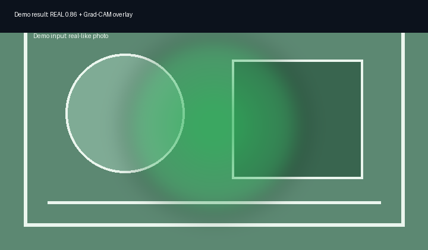
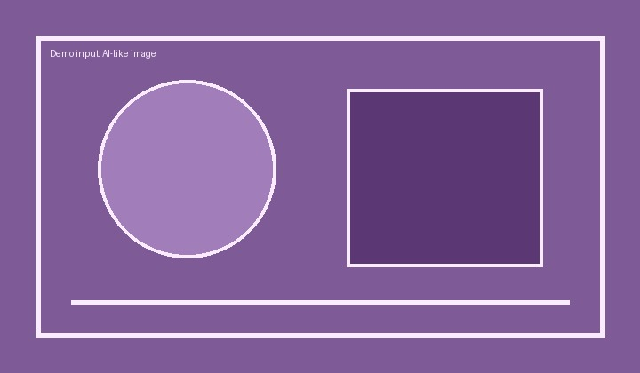
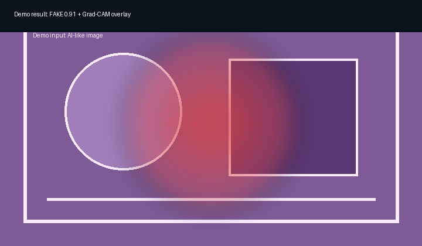

# DeepFakeDetector - AI Image Authenticity Checker


Upload an image, receive a real/fake verdict with confidence, and inspect a Grad-CAM-style heatmap showing the visual regions used by the detector.

The project is designed as a complete applied-AI product: React frontend, FastAPI backend, async analysis jobs, SQLite history, model abstraction, explainability output, tests, CI, and deployment docs.

## Demo

| Demo input | Demo output |
|---|---|
|  |  |
|  |  |

These images demonstrate the UI/result flow. The app also includes one-click `Try Real Sample` and `Try AI Sample` buttons for reviewer-friendly demos. In `DEMO_MODE=true`, verdicts are deterministic simulations so reviewers can run the full product without downloading large model weights.

Live demo: https://deepfake-detector.vercel.app

## Model Modes

### Demo mode, default

Demo mode requires no model weights and is intended for local review, frontend development, CI, and portfolio demos.

```env
DEMO_MODE=true
USE_MOCK_MODEL=true
```

The backend still exercises validation, async jobs, SQLite persistence, status polling, and heatmap generation. The classification result is simulated and must not be treated as a forensic prediction.

### Real inference mode

Real mode loads EfficientNet-B4 DeepShield weights from Hugging Face.

```powershell
cd backend
python download_model.py
```

Then set:

```env
DEMO_MODE=false
USE_MOCK_MODEL=false
MODEL_PATH=./weights/best_model.pth
```

## Quick Start

### Prerequisites

- Node.js 20+
- Python 3.12 recommended
- npm

### Install

```powershell
git clone https://github.com/Jatinprajapati7869/DeepFakeDetector-AI-Image-Authenticity-Checker.git
cd DeepFakeDetector-AI-Image-Authenticity-Checker
npm run setup
```

### Run backend

```powershell
cd backend
copy .env.example .env
python -m uvicorn app.main:app --reload
```

Backend API: http://127.0.0.1:8000

### Run frontend

```powershell
cd frontend
npm run dev
```

Frontend app: http://localhost:5173

## Verification

Run the same gates used for portfolio readiness:

```powershell
cd C:\Users\Administrator\Documents\Github\DeepFakeDetector-AI-Image-Authenticity-Checker
python -m pytest backend/tests -W error
cd frontend
npm run lint
npm test -- --run
npm run build
npm run test:e2e
```

Expected local status after this cleanup:

- Backend: 30 tests passing with warnings treated as errors
- Frontend: 52 unit tests passing with no React `act(...)` warnings
- Frontend production build passing
- Playwright upload smoke test passing

## Architecture

```text
React + TypeScript UI
        |
        v
FastAPI API -- async job registry -- SQLite history
        |
        v
Detector abstraction
  - demo mode: deterministic mock detector
  - real mode: EfficientNet-B4 weights
        |
        v
Grad-CAM heatmap + artifact scores
```

## Engineering Highlights

- Async FastAPI analysis jobs with status polling.
- SQLite history API with tested pagination and item retrieval.
- Detector abstraction that separates demo behavior from real model inference.
- Grad-CAM-style heatmap generation for explainability.
- Image validation for MIME type and upload size.
- Rate limiting middleware for analysis endpoints.
- Separate backend and frontend test suites.
- GitHub Actions CI verifies backend lint/format/tests, evaluation metric tests, frontend lint/tests/build, and Playwright E2E.
- Real-mode evaluation CLI writes reproducible JSON metrics with `model_training/evaluate.py`.

## Documentation

- [API Reference](docs/API.md)
- [Architecture Overview](docs/ARCHITECTURE.md)
- [Troubleshooting](docs/TROUBLESHOOTING.md)
- [Evaluation Report](docs/EVALUATION.md)
- [Model Card](docs/MODEL_CARD.md)
- [Contributing Guide](CONTRIBUTING.md)

## Tech Stack

| Layer | Technology |
|---|---|
| Frontend | React 18, TypeScript, Vite, Tailwind CSS |
| Backend | Python 3.12, FastAPI, SQLAlchemy, SQLite |
| Model | EfficientNet-B4 via `timm` in real inference mode |
| Explainability | Grad-CAM-style heatmap output |
| Tooling | Pytest, Vitest, React Testing Library, Playwright, Ruff, ESLint, GitHub Actions |

## Deployment

### Backend

The backend can run on Render or any container host. `download_model.py` downloads weights at startup when real inference is enabled and falls back to mock mode if the download fails.

### Frontend

The frontend is Vercel-ready. Set:

```env
VITE_API_BASE_URL=https://your-backend-url
```

## Limitations

- Demo mode is simulated and exists only to make the product easy to review.
- Real mode is not a forensic guarantee; use results as one signal among many.
- Model performance depends on training data coverage and generation method drift.
- Grad-CAM highlights are approximate attention explanations, not proof of manipulation.
- Adversarially edited or heavily compressed images may bypass detector confidence.

## License

MIT License. See [LICENSE](LICENSE).


